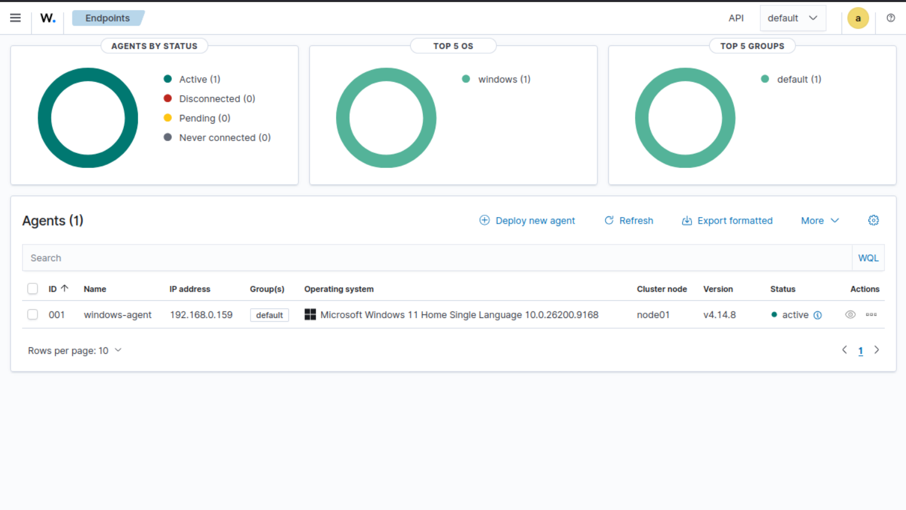
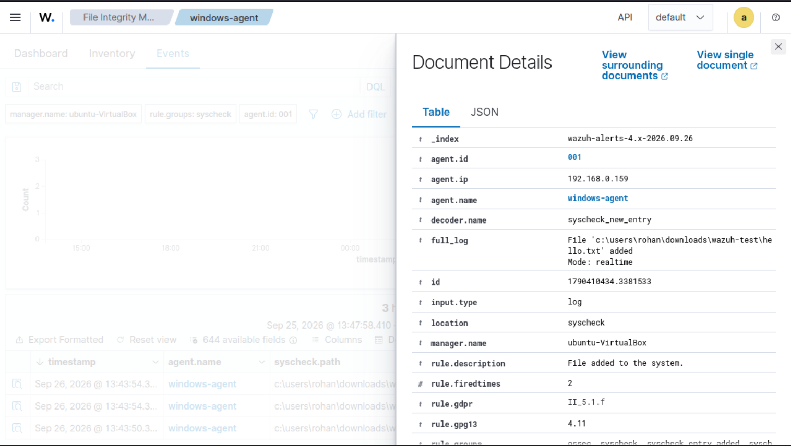
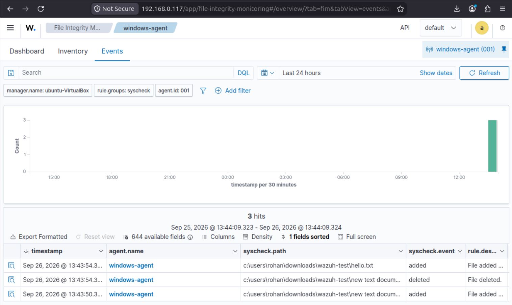
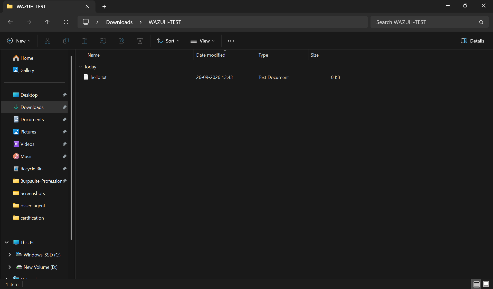
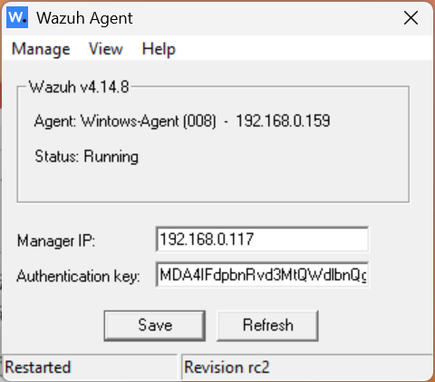

# Wazuh SIEM Homelab

A hands-on Security Operations Center (SOC) homelab built using Wazuh to monitor a Windows 11 endpoint and detect file integrity changes.

## Project Overview

This project demonstrates the deployment and configuration of a Wazuh SIEM environment with:

- Wazuh Manager
- Wazuh Indexer
- Wazuh Dashboard
- Windows 11 Wazuh Agent
- File Integrity Monitoring (FIM)
- Real-time file change detection
- Security event analysis

## Data Flow
- The Wazuh Agent runs on the Windows 11 endpoint.
- The agent monitors configured files and system activity.
- File integrity events are sent to the Wazuh Manager.
- The Wazuh Manager processes the events.
- Events are indexed by Wazuh Indexer.
- The Wazuh Dashboard provides a centralized interface for investigation and analysis.

## Architecture

Windows 11 Endpoint
        |
        | Wazuh Agent
        |
        v
Wazuh Manager
        |
        v
Wazuh Indexer
        |
        v
Wazuh Dashboard

## Environment

| Component | Details |
|---|---|
| SIEM | Wazuh 4.14.8 |
| Server OS | Ubuntu |
| Endpoint OS | Windows 11 |
| Virtualization | VirtualBox |
| Agent ID | 001 |
| Monitoring | File Integrity Monitoring |
| Network | Local lab network |

## Implementation

Deployed the Wazuh all-in-one environment consisting of:
- Wazuh Manager
- Wazuh Indexer
- Wazuh Dashboard
- Filebeat

### 1. Wazuh Server

Deployed the Wazuh all-in-one stack consisting of:

- Wazuh Manager
- Wazuh Indexer
- Filebeat
- Wazuh Dashboard

### 2. Windows Agent

Installed and connected a Windows 11 endpoint to the Wazuh Manager.

The endpoint appears in the Wazuh Dashboard as: windows-agent (001)

### 3. File Integrity Monitoring

Configured Wazuh to monitor a Windows directory for real-time changes.

Example configuration: <directories realtime="yes">C:\Users\USERNAME\Test</directories>

### 4. Detection Testing

Created and deleted files inside the monitored directory.

Wazuh successfully generated events for:
File creation
File deletion

### 5 Future Improvements
Windows Event Log monitoring
PowerShell event detection
Authentication monitoring
Brute-force detection
Sysmon integration
Custom detection rules
MITRE ATT&CK mapping
Automated incident response
Additional Linux endpoints

## Screenshots

### Wazuh Agent Dashboard

### File Integrity Monitoring

### File Integrity Alert

### Test Directory

### wazuh agent

### Key Commands

## System Preparation
- sudo apt update
- sudo apt upgrade -y

## Verify Wazuh Services
- sudo systemctl status wazuh-manager
- sudo systemctl status wazuh-indexer
- sudo systemctl status wazuh-dashboard
- sudo systemctl status filebeat

## Check Network Configuration
- ip addr

## All-in-one deployment
- sudo bash wazuh-install.sh -a

## Monitor Wazuh Installation Logs
- sudo tail -f /var/log/wazuh-install.log

## Reference for guided installation
https://documentation.wazuh.com/current/installation-guide/index.html